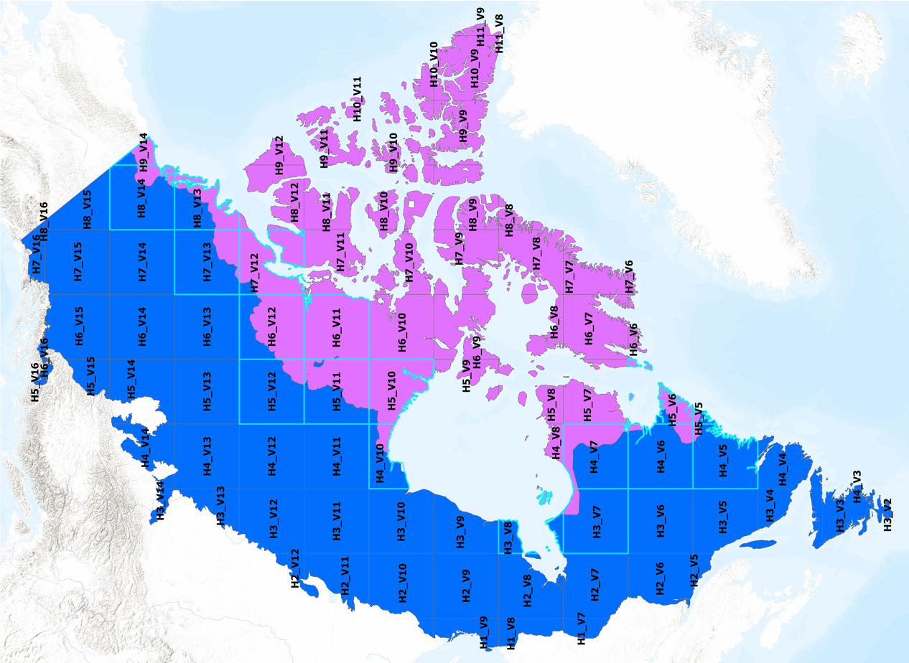

Tools for the DVM-DOS-TEM Circumpolar run input/output data processing. 

# Circumpolar Run Work Plan

## The map of the Circumpolar


## Empty tiles
|    |    |     |     |    |    |
|---------|---------|---------|---------|---------|---------|
| H10_V7  | H11_V19 | H11_V20 | H12_V18 | H12_V20 | H12_V4  |
| H12_V6  | H13_V20 | H14_V20 | H3_V14  | H9_V13  |         |

HG: All these tiles have land (as delineated in the example below - blue polygons).
They were thus included in the original circumpolar map where a 1 mile buffer were applied
to the boundary of the land (as delineated in the example below - pink polygons).
However, some of this land (e.g. tiny islands of the Aleutians) were not covered by the 
vegetation map for instance. 


Empty tile could also result from being located entirely on Greenland icefield (e.g. H10_V7)


One last case occuring in this list of empty tiles, is the lack of coverage from the 
vegetation map in the sourthern most regions (see example 3 below) 


## Stage I: Alaska Tiles [constant OLT]

This document outlines the workflow for processing Alaska tiles as part of the Circumpolar run.

---

## Initial Tile Workload Assignment

| Elchin       | Valeria      | Doğukan     |
|--------------|--------------|-------------|
| H10_V14      | H11_V20      | H8_V14      |
| H10_V15      | H12_V18      | H8_V15      |
| H10_V16      | H12_V20      | H8_V16      |
| H10_V17      | H13_V20      | H8_V17      |
| H10_V18      | H14_V20      | H8_V18      |
| H10_V19      | H5_V15       | H9_V14      |
| H11_V14      | H5_V16       | H9_V15      |
| H11_V15      | H6_V15       | H9_V16      |
| H11_V16      | H6_V16       | H9_V17      |
| H11_V17      | H7_V15       | H9_V18      |
| H11_V18      | H7_V16       | H9_V19      |
| H11_V19      |              |             |

## After Tile Analysis
Removed tiles with run-status = 0 for all grid cells. 

## Tile Workload Assignment

| Elchin       | Valeria      | Doğukan     |
|--------------|--------------|-------------|
| H10_V14      |              | H8_V14      |
| H10_V15      |              | H8_V15      |
| H10_V16      |              | H8_V16      |
| H10_V17      |              | H8_V17      |
| H10_V18      |              | H8_V18      |
| H10_V19      | H5_V15       | H9_V14      |
| H11_V14      | H5_V16       | H9_V15      |
| H11_V15      | H6_V15       | H9_V16      |
| H11_V16      | H6_V16       | H9_V17      |
| H11_V17      | H7_V15       | H9_V18      |
| H11_V18      | H7_V16       | H9_V19      |
|              |              |             |


---
# Scenario Run Folder Structure

- Region (Alaska)
  - tile_1_sc
  - tile_2_sc
  - ...
  - tile_n_sc
    - ssp1_2_6_access_cm2_split (base_scenario)
    - ssp1_2_6_mri_esm2_0_split
    - ssp2_4_5_access_cm2_split
    - ...
    - ssp5_8_5_mri_esm2_0_split
      - batches_[0...99]
      - all_merged (need to have scenario name in the attr, tile_id, exec time)
        - summary_plots.pdf

---
## Instruction on Step-by-Step Tile Run
### Initial Setup

1. **Disable DSL in config**  
   Navigate to the `dvm-dos-tem/config/config.js` file and **turn off the DSL setting** for all stages. *(Note: the current `pr` branch may have it enabled.)*

HG: Why? It hasn't clearly been demonstrated that DSL was the reason for any error in the model. Cold climate simulations result in soil thermal computation being very slow, 
but the cause is very likely the cold climate, not the  DSL. So, unless there is more evidence of serious issues with DSL, it should be turned on! We loose a lot of process-based dynamic by turning it off. Furthermore, all calibrations have been conducted with DSL on.

2. **Create Alaska Working Directory**  
   On `/mnt/exacloud`, create your working folder using your username:
   ```
   /mnt/exacloud/<yourname>_woodwellclimate_org/Alaska
   ```
   Copy your assigned tiles into this folder and navigate into the working tile directory.
   ```bash
   gsutil -m  cp -r gs://regionalinputs/CIRCUMPOLAR/<tile_name>
   ```
---

## Workflow Steps

### 1. Process Climate Data

It could be worse to check the `run-mask.nc` file in the tile. If all zeros, it means that all gridcells are off.
Run Hélène’s gap-filling script:

```bash
python process_climate_data_gapfill.py /path/to/tile
```

> **Note**: You may need to rename the gap-filled output file (this step will be improved in future versions).
HG: agreed - until the outputs have been thoroughly investigated - let's store the 
gap-filled data in separate files from the original downscaled climate data.
   
---

### 2. Analyze Input Data

Check for errors or anomalies (e.g., negative precipitation or NIRR values):

```bash
python analyze_TEM_nc.py /path/to/folder_or_file
```

---

### 3. Generate Climate Scenarios

Generate SSP1-2.6 scenarios using:

```bash
python generate_climate_scenarios.py /path/to/input_folder /path/to/output_folder
```

Only **`ssp1_2_6_access_cm2__ssp1_2_6`** will be used in this stage.

---

### 4. Split Scenarios into Batches

From the directory **above** the scenario folder, run:

```bash
bp batch split -i ssp1_2_6_access_cm2__ssp1_2_6 -b <path_to_folder>/<tile_name>_scen/ssp1_2_6_access_cm2__ssp1_2_6_split \
  --p 100 --e 2000 --s 200 --t 123 --n 76
```

This will create 100 batch folders in the `..._split` directory.

HG: transient run should be 124 years! The historical inputs run from January 1st 1901 to December 31st 2024, i.e. 124 years. With current specs, there is temporal discontinuity btw historical and scenario simulations. One of the consequences of this temporal discontinuity
would consist in the restart files created from the historical simulations (restart-tr.nc) 
would likely not be useful to run scenarios.

---

### 5. Run Model Batches

- **Run all batches at once**:
  ```bash
  bp batch run -b /mnt/exacloud/your_folder/Alaska/tilename/ssp1_2_6_access_cm2__ssp1_2_6_split`
  ```

- **Run a single batch**:
  Navigate to the batch folder and run:
  ```bash
  sbatch slurm_runner.sh
  ```

---

### 6. Monitor Execution

Use `squeue` or `sacct` to monitor job progress:

```bash
squeue -u $USER
sacct -j <job_id>
python check_runs.py ssp1_2_6_access_cm2__ssp1_2_6_split
```

> An auxiliary monitoring script will be added to this repo soon.

---

### 7. Merge Output

Once all batch jobs are complete:

```bash
bp batch merge -b <tile_name>
```

---

### 8. Plotting Results

Once all batches are merged, run the plotting script.

```bash
python plot_nc_all_files.py full_path_your_tile/ssp1_2_6_access_cm2__ssp1_2_6_split/all_merged/
```

---

### Next Scenario: ssp1_2_6_mri_esm2_0__ssp1_2_6

Once Stage I is complete, we can proceed to the next scenario.  
For this stage, there is **no need** to re-run the `-pr`, `-eq`, or `-sp` phases.  

HG: Transient doesn't need to be re-run either - unless there is some lingering issues 
with reasing in the restart files. For this first set of simulations, lets try without repeating historical runs. 
The appropriate set of flags to run DVM-DOS-TEM in this configuration is:
./dvmdostem -l fatal -f /path/to/config/config.js --no-output-cleanup --restart-run  -p 0 -e 0 -s 0 -t 0 -n 76

Instead, we will use the script below to:  

1. Copy the `restart-tr.nc` file into each batch directory.  
2. Modify the Slurm job script in each batch to enable a restart run.  

Before running this script, the new scenario must first be split into batches — see [Step 4](#4-split-scenarios-into-batches) for details.  

```bash
python generate_next_scenario.py path_to_scenario/ssp1_2_6_access_cm2__ssp1_2_6_split path_to_next_scenario/..._split
```

After completing this step, repeat Steps **5** through **8** from **Stage I**.

The following command automates splitting and file copying steps for all scenarios. Keep this script in the folder above the scenario folder. 
```bash
python orchestrate_scenarios.py --path-to-folder /mnt/exacloud/ejafarov_woodwellclimate_org/Alaska/ \
--tile-dir H10_V14_sc --new-scenario-script generate_next_scenario.py
```

---

### Instructions for Running the Automation Script
#### Automation of the steps 1-8, next scenario, and the rest of the scenarios 

Before running the automation script, please ensure that the **folder structure** is properly set up. Refer to [**Scenario Run Folder Structure**](#scenario-run-folder-structure) for full details.

#### 📁 Folder Structure

For each **region** (e.g., `Alaska`), the following folders must exist:

- `input_tiles/` — contains the original input tiles
- `tile#ids_sc/` — subfolders for each tile, e.g.:
  - `H10_V14_sc/`
  - `H10_V15_sc/`
  - `H10_V16_sc/`
- `LOG/` — `run_tiles.py` will automatically create it if it doesn’t exist

> ⚠️ In the future, `tile#ids_sc` folders will be moved into corresponding **case folders**, such as:
> - `olt_const/`
> - `olt_nonconst/`
> - `olt_nonconst_fire/`
> - ...

#### 🔤 Notation

- **Base scenario**: This refers to the one scenario (e.g., `sp`, `eq`, `pr`) that is run in full (including splitting, batch running, merging, and plotting).
- Currently, we support **8 scenarios**. Any one of them can serve as the **base scenario** — we choose `ssp1_2_6_access_cm2`.

#### 🚀 Running the Script

You can run the automation in different modes depending on your needs:

#### 🔁 Full Mode — Run Base + All Others
```bash
python automation_script.py {tile#} --mode full
```

#### 🧱 Base-Only Mode — Run Only the Base Scenario
```bash
python automation_script.py {tile#} --mode base
```

#### 🔄 Scenario-Only Mode — Run the Remaining 7 Scenarios
```bash
python automation_script.py {tile#} --mode sc
```

Replace `{tile#}` with the tile ID, e.g. `H11_V15`.

#### 🧵 Running Multiple Tiles in Background (with `screen`)

To run tiles without losing progress if your SSH connection is interrupted:

1. Start a new screen session:
   ```bash
   screen
   ```

2. Run your tile batch script:
   ```bash
   python run_tiles.py
   ```

3. Detach from the screen (keep it running in background):
   - Press `Ctrl + A`, then `D`

4. Reattach to your screen session later:
   ```bash
   screen -r
   ```

#### ✍️ Editing the `run_tiles.py` Script

Open `run_tiles.py` and modify this list:

```python
scs = ["H11_V15", "H11_V16", "H11_V17", ...]
```

Include the tile IDs you want to process. This script will:

- Run each tile in **`--mode sc`**
- Save output logs into the `LOG/` folder (automatically created if missing)
- Log file names will follow the pattern:  
  `LOG/H11_V15.log`, `LOG/H11_V16.log`, etc.

You can monitor progress by checking each corresponding log file:

```bash
tail -f LOG/H11_V15.log
```

---

## Stage II: Canada Tiles [constant OLT]




| Column 1 | Column 2 | Column 3 |
| -------- | -------- | -------- |
| H1\_V10  | H6\_V12  | H4\_V4   |
| H9\_V9   | H3\_V14 [empty]  | H8\_V9   |
| H1\_V7   | H6\_V6   | H4\_V5   |
| H10\_V10 | H3\_V2   | H9\_V10  |
| H1\_V8   | H6\_V7   | H4\_V6   |
| H10\_V11 | H3\_V3   | H9\_V11  |
| H1\_V9   | H6\_V8   | H4\_V7   |
| H10\_V8  | H3\_V4   | H9\_V12  |
| H2\_V10  | H6\_V9   | H5\_V11  |
| H10\_V9  | H3\_V5   | H9\_V14  |
| H2\_V11  | H7\_V10  | H5\_V12  |
| H11\_V8  | H3\_V6   | H9\_V13 [empty]  |
| H2\_V12  | H7\_V11  | H5\_V13  |
| H11\_V9  | H3\_V7   | H5\_V14  |
| H2\_V5   | H7\_V12  | H5\_V15  |
| H4\_V8   | H3\_V8   | H5\_V16  |
| H2\_V6   | H7\_V6   | H5\_V5   |
| H5\_V10  | H3\_V9   | H6\_V13  |
| H2\_V7   | H7\_V7   | H6\_V14  |
| H5\_V6   | H4\_V10  | H6\_V15  |
| H2\_V8   | H7\_V8   | H6\_V16  |
| H5\_V7   | H4\_V11  | H7\_V13  |
| H2\_V9   | H7\_V9   | H7\_V14  |
| H5\_V8   | H4\_V12  | H7\_V15  |
| H3\_V10  | H8\_V10  | H7\_V16  |
| H5\_V9   | H4\_V13  | H8\_V13  |
| H3\_V11  | H8\_V11  | H8\_V14  |
| H6\_V10  | H4\_V14  | H8\_V15  |
| H3\_V12  | H8\_V12  | H8\_V16  |
| H6\_V11  | H4\_V3   |          |
| H3\_V13  | H8\_V8   |          |

## Notes

- Make sure you are working within your own namespace/folder on Exacloud to avoid conflicts.
- Follow naming conventions carefully to ensure smooth merging and reproducibility.

---

## To Do

- [x] Add monitoring script
- [x] Finalize plotting script
- [x] Automate renaming of gap-filled files

### automation_script (Elchin/Doğukan)
- [x] pull_tile
- [x] run_gapfill_script
- [x] generate_scenarios
- [x] split_base_scenario
- [x] run_base_scenarios
- [x] wait_for_base_scenarios_to_finish
- [x] merge_base_scenarios
- [x] split_rest_scenarios
- [x] modify_new_scenarios_copy_restart_file
- [x] run_rest_scenarios
- [x] merge_batches
- [x] plot_all_merged_scenarios

### stats 
- [ ] in check_run stat on min, max exec time, and batch#

### Post-analysis (Hélène)
- [ ] A list of the steps (functional types, benchmarking, etc.)

### To update dvm-dos-tem version 
```bash
git clone https://github.com/uaf-arctic-eco-modeling/dvm-dos-tem.git 
cd dvm-dos-tem
source /dependencies/setup-env.sh
make USEMPI=true
```bash

HG: Note related to automation of scenario simulations. 
1- scnearion and GCM names should be stores in the metadata of the outputs
2- sets of outputs per scneario should be stored in different directoriies. 
Directory name should include the name of the scenario and GCM
3- path to restart files should be included in the config file so there is
no more need to copy the restart file in every scenario output directory...


