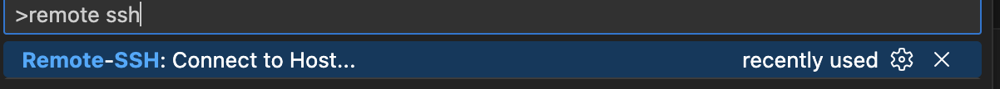
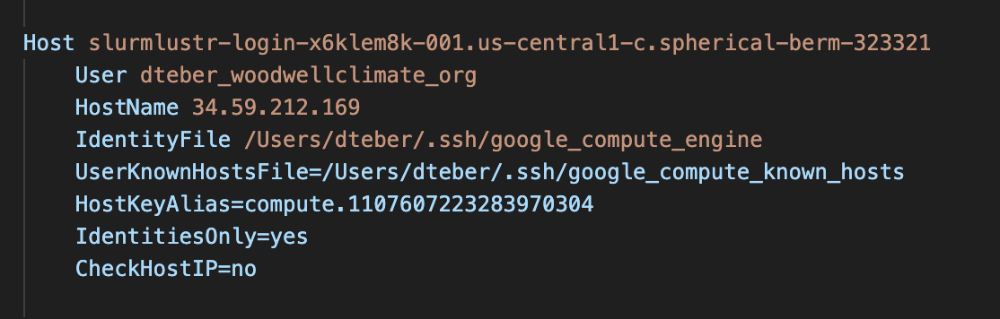
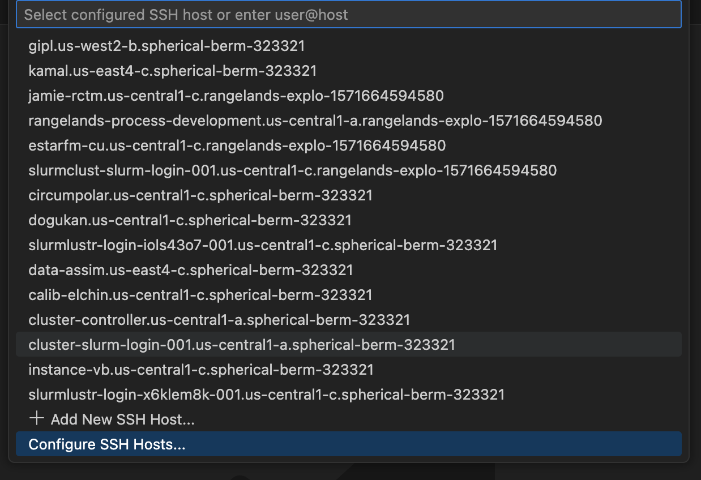

# HPC Cluster Reference

## How to Login

1. Navigate to the VM instances dashboard
2. Look for a machine that includes `slurm` and `login` keywords at the same time. Ex: `slurmlustr-login-x6klem8k-001`
   
   

3. Click the SSH button on the right
4. You're in!

## Run a Simple Slurm Job

Once you're logged in, you will be in your home directory. Ex: `/home/dteber_woodwellclimate_org`. Run a few Slurm commands to make sure it works, such as `sinfo`, `squeue`, and `sacct`.

Then, to get the hang of Slurm, write a bash script in your home directory that echoes `Hello, world!` and submit it as a job.

Here is an example job script:

```bash
#!/bin/bash

#SBATCH --job-name="hello-world"
#SBATCH -p compute
#SBATCH -N 1

echo 'Hello, world!'
```

## bp Package

To avoid doing the same things over and over again, such as configuring `config.js` files, creating bash job files, etc., we created a Python package called `bp`, which automates a lot of tasks we'd do in the cluster. Run `bp --help` to make sure it's installed.

If you log in to the cluster for the very first time, run `bp init` to initialize your workspace.

As a reference, the code for this package lives in `/opt/batch-processing`, in case you need to make changes to the source code.

Once you make a change to this package, you need to reinstall it using `pip install /opt/batch-processing`. If you need to make multiple changes and test them iteratively, you can install the package in editable mode (`pip install -e /opt/batch-processing`) so that you don't have to reinstall it. The changes would reflect automatically.

## Know Where to Run Big Simulations

The cluster has limited storage. We need to be careful where to write our results. Otherwise, we'd have `No space left on the device` error and waste our time. To avoid that, run `df -h` command to see all the available space in the file system. Look to the `Avail` column to see which path has more storage. Most of the time, the answer will be `/mnt/exacloud`. However, in case we migrate from Lustre, look for the other paths and navigate to that folder.

## Make Code Changes in the Cluster (VS Code)

Unless you are Vim-savvy or need to make a very small change in a file, writing code is very difficult in the cluster if you are used to using an IDE. For that, we need to set up a remote connection to the cluster from our local so that we can use our editor to make code changes. Note that these instructions only apply to VS Code.

### Configuration

1. Make sure you have `gcloud` installed
2. Run `gcloud compute config-ssh`
3. Navigate to VS Code
4. Install **Remote - SSH** extension
5. Press `Command+Shift+P` (or `Ctrl+Shift+P` on Windows/Linux)
6. Type `remote SSH:`
   
   

7. Select **Configure SSH hosts**
   
   

8. Select the first option
9. Make sure your username is added to the host. If it's not, add it and save the file.
   
   

### Connect to Your Machine

1. Press `Command+Shift+P` again (or `Ctrl+Shift+P` on Windows/Linux)
2. Select **Connect to Host**
3. Select your machine from the list
4. And, that's it! You should be logged in to the host.
